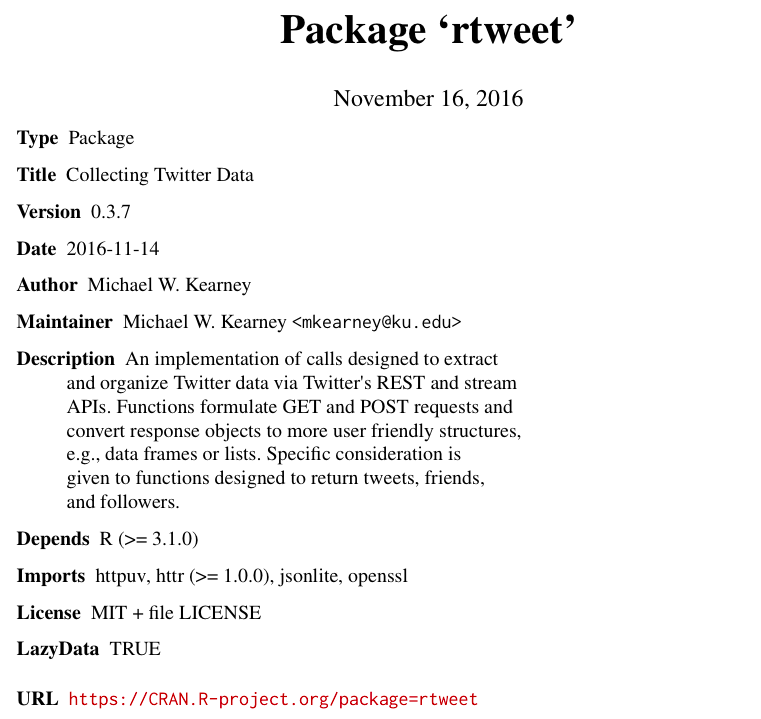
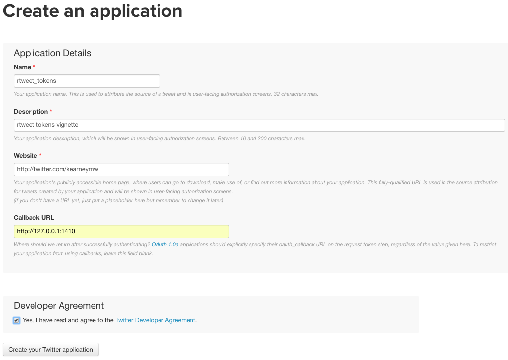
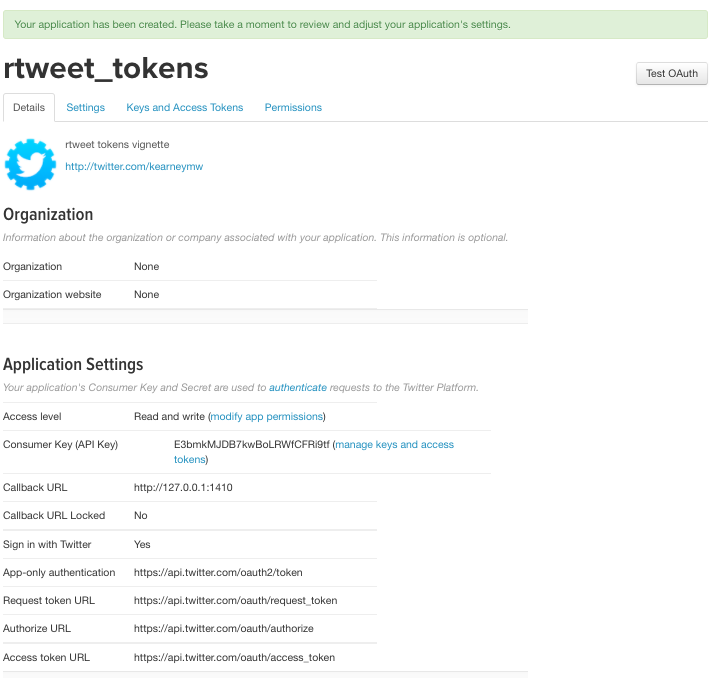
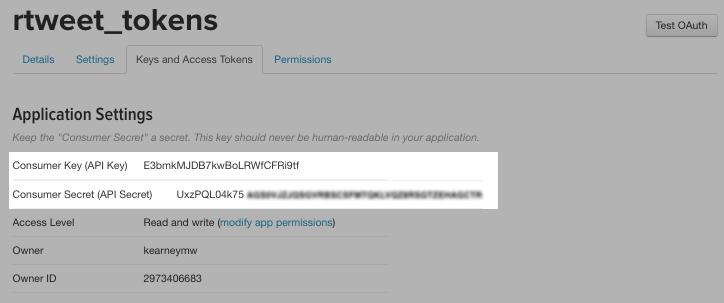
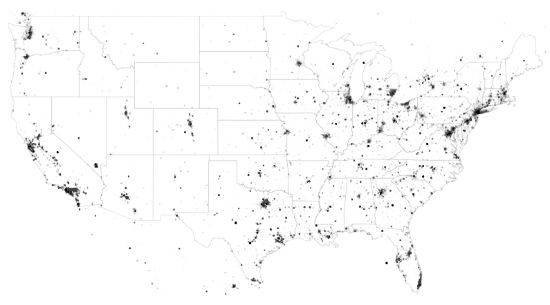
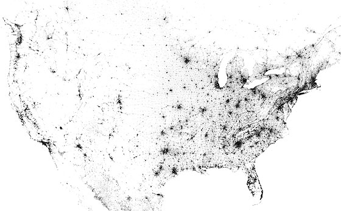

## Get these slides
- Github repository: [https://github.com/mkearney/rusersKC](https://github.com/mkearney/rusersKC)
- Live version of slides: [https://mkearney.github.io/rusersKC](https://mkearney.github.io/rusersKC)

---

## About me
**Education and training**
- PhD in Communication Studies from KU
- Center for Research Methods & Data Analysis

**Research topics**
- Selective exposure, partisanship, new media, data journalism
- Dissertation...

---

## &nbsp;


---

## &nbsp;



---

## Agenda for this talk
- Quick intro to Twitter APIs
- Getting started with rtweet
  - Authorization token(s)
  - Package resources

- Tour of rtweet functions
  - Friends/followers
  - Users/tweets

--- .transition

## &nbsp;

<h1 class="mytransition">Twitter APIs</h1>

---

## Twitter data
- Twitter makes data available via Application Program Interfaces
  (API)
  - **API**: protocols for making and sending requests

- Twitter APIs of interest:
  - **REST**: Search, read profile info, post Tweets
  - **Streaming**: Monitor tweets in real-time

---

## Package resources
- Website: [mkearney.github.io/rtweet](https://mkearney.github.io/rtweet)
- Vignettes:


```r
## Authorizing API access
vignette(topic = "auth", package = "rtweet")

## Overview
vignette(topic = "intro", package = "rtweet")

## Streaming API
vignette(topic = "stream", package = "rtweet")
```

- Help:


```r
## list of functions
help(package = "rtweet")
```

- My updates: [twitter.com/kearneymw](https://twitter.com/kearneymw)

--- .transition

## &nbsp;

<h1 class="mytransition">Getting started with rtweet</h1>

---

## Installing and loading rtweet

- Download rtweet from CRAN


```r
## download from CRAN
install.packages("rtweet")
```

- Get the latest [dev] version from Github


```r
## or download dev version from Github
if (!"devtools" %in% installed.packages()) {
    install.packages("devtools")
}
devtools::install_github("mkearney/rtweet")

## load rtweet
library(rtweet)
```

---

## Create Twitter App
- Go to: [https://apps.twitter.com](apps.twitter.com)
- For call back enter `http://127.0.0.1:1410`



---

## Keys and access tokens



---

## Copy keys



---

## Create token


```r
## whatever name you assigned to your created app
appname <- "rtweet_token"

## api key (example below is not a real key)
key <- "XYznzPFOFZR2a39FwWKN1Jp41"

## api secret (example below is not a real key)
secret <- "CtkGEWmSevZqJuKl6HHrBxbCybxI1xGLqrD5ynPd9jG0SoHZbD"

## create token named "twitter_token"
twitter_token <- create_token(
    app = appname,
    consumer_key = key,
    consumer_secret = secret)
```

---

## Save token


```r
## path of home directory
home_directory <- path.expand("~")

## combine with name for token
file_name <- file.path(home_directory, "twitter_token.rds")

## save token to home directory
saveRDS(twitter_token, file = file_name)
```

---

## Set environment variable


```r
## On my mac, the .Renviron text looks like this:
##     TWITTER_PAT=/Users/mwk/twitter_token.rds

## assuming you followed the procodures to create "file_name"
##     from the previous code chunk, then the code below should
##     create and save your environment variable.
cat(paste0("TWITTER_PAT=", file_name),
    file = file.path(home_directory, ".Renviron"),
    append = TRUE)
```

--- .transition

## &nbsp;

<h1 class="mytransition">rtweet functions</h1>

---

## Get followers


```r
## get most recent 75k followers
flw1 <- get_followers("realdonaldtrump", n = 75000)
flw1
## # A tibble: 75,000 x 1
##               user_id
##                 <chr>
##  1 861962717929680896
##  2 873573516393803776
##  3 873572121561124864
##  4 873573581451657216
##  5 873562392952676352
##  6 873573260625158144
##  7 873573740864561152
##  8 873573140814802944
##  9 871801684510507008
## 10 873573061219504128
```

---

## Get more followers


```r
## set page value using next cursor extractor
page <- next_cursor(flw1)

page
## [1] "1569708984537163520"

## use page value to continue where left off
flw2 <- get_followers(
    "realdonaldtrump", n = 75000, page = page)
```

---

## Manage rate limits

- Use the `rate_limit` function


```r
rate_limit(get_tokens())[1:3, ]
##                    query limit remaining       reset
## 1             lists/list    15        15 14.975 mins
## 2      lists/memberships    75        75 14.975 mins
## 3 lists/subscribers/show    15        15 14.975 mins
```

---

## Get friends


```r
## get list of accounts followed BY a user
fds <- get_friends("kearneymw")
fds
## # A tibble: 962 x 1
##              user_id
##                <chr>
## 1 843078227488915456
## 2 835148691593887744
## 3 795751822585688064
## 4 707260960491376640
## 5         1349865410
## 6 836165272780345344
## 7             428333
## 8          227812077
## 9 859179631664021504
## 10          337950234
## # ... with 952 more rows

next_cursor(fds)
## [1] "0"
```

---

## Lookup users


```r
## get users data for my friends
usrs <- lookup_users(fds$user_id)

usrs
## # A tibble: 929 x 36
##               user_id               name     screen_name            location
##                 <chr>              <chr>           <chr>               <chr>
##  1 795751822585688064       Scott Harris       sm_kepler        New York, NY
##  2 707260960491376640   Mohammed Zakaria zakariaCatapult         Chicago, IL
##  3         1349865410     Marnie Ritchie   marnieritchie          Austin, TX
##  4 836165272780345344       Stuart Allen    steadystuart                <NA>
##  5             428333  CNN Breaking News          cnnbrk          Everywhere
##  6          227812077             rubaie         brubaie               kcmo
##  7          337950234            tewsie1         tewsie1         Waterloo IA
##  8           14135384     Seth Ellsworth      pinto4life          Austin, TX
##  9           57371972 amanda luppes ford         aluppes              Austin
## 10          224161598     Georgina Cosma         gcosma1 Nottingham, England
## # ... with 919 more rows, and 32 more variables: description <chr>,
## #   protected <lgl>, followers_count <int>, friends_count <int>,
## #   listed_count <int>, created_at <dttm>, favourites_count <int>,
## #   utc_offset <int>, time_zone <chr>, geo_enabled <lgl>, verified <lgl>,
## #   statuses_count <int>, lang <chr>, contributors_enabled <lgl> ...
```

---

## Search tweets


```r
rt <- search_tweets(
    "rstats", n = 300, include_rts = FALSE, exact = TRUE)
## Searching for tweets...
## Finished collecting tweets!

rt
## # A tibble: 300 x 35
##        screen_name            user_id          created_at          status_id
##              <chr>              <chr>              <dttm>              <chr>
##  1            phnk           14460093 2017-06-10 16:16:14 873574535358029824
##  2      jletteboer           92526801 2017-06-10 16:12:47 873573666776391680
##  3 BigDataInsights           89191817 2017-06-10 16:12:42 873573649416163328
##  4 CRANberriesFeed          233585808 2017-06-10 16:02:18 873571030740201473
##  5   DeborahTannon 821976676842242050 2017-06-10 16:00:52 873570670097182721
##  6 AnalyticsVidhya         2311645130 2017-06-10 16:00:18 873570526085697537
##  7 EdwardEgrosFox4           15553592 2017-06-10 15:59:12 873570249186136065
##  8       Rbloggers          144592995 2017-06-10 15:57:17 873569768019767296
##  9     geoappsmith         3306901413 2017-06-10 15:56:53 873569666547032064
## 10      juliasilge           13074042 2017-06-10 15:56:15 873569506215346176
## # ... with 290 more rows, and 31 more variables: text <chr>,
## #   retweet_count <int>, favorite_count <int>, is_quote_status <lgl>,
## #   quote_status_id <chr>, is_retweet <lgl>, retweet_status_id <chr> ...
```

---

## Plain tweets


```r
rt$text[1:5]
## [1] "Dear #rstats – If R is executable from Microsoft Server, does that mean that it's now technically feasible to run a DDoS from R?"
## [2] "Networkx #Datascience #Bigdata Tools is out! https://t.co/gASnKtH0bU Tweets via @CodeDocta @ijstokes @EwaldSchmidt #rstats"
## [3] "#RStats —Engaging the tidyverse Clean Slate Protocol : https://t.co/mrjCI8YYdH"

## strip formatting, URLs, mentions, hashtags, etc.
plain_tweets(rt$text[1:5], include_hashtags = FALSE)
## [1] "dear if r is executable from microsoft server does that mean that its now technically feasible to run a ddos from r"
## [2] "networkx tools is out tweets via"
## [3] "engaging the tidyverse clean slate protocol"
```

--- .dark3

## Plot


```r
## time series plot
ts_plot(rt, by = "hours")
```


---

## Users data

- With tweets data you also get data about the users via `users_data()`


```r
## extract users data from rt (tweets data)
users_data(rt)
## # A tibble: 300 x 36
##               user_id                 name     screen_name
##                 <chr>                <chr>           <chr>
##  1           14460093                  Fr.            phnk
##  2           92526801       John Letteboer      jletteboer
##  3           89191817          Marty Wells BigDataInsights
##  4          233585808 CRAN Package Updates CRANberriesFeed
##  5 821976676842242050       Deborah Tannon   DeborahTannon
##  6         2311645130     Analytics Vidhya AnalyticsVidhya
##  7           15553592         Edward Egros EdwardEgrosFox4
##  8          144592995           R-bloggers       Rbloggers
##  9         3306901413         Geo.Appsmith     geoappsmith
## 10           13074042          Julia Silge      juliasilge
## # ... with 290 more rows, and 33 more variables: location <chr> ...
```

---

## Search by geocode

- Geo-location searches using longitude,latitude,radius


```r
## load state data
data("state")

## initialize vector
state_tweets <- vector("list", 50)

## loop through 50 states
for (i in seq_along(state_tweets)) {
    state_tweets[[i]] <- search_tweets(
        paste0("comey OR trump geocode:",
               state.center$y[i], ",",
               state.center$x[i], ",",
               "50mi"),
    )
}
```

--- .dark3

## &nbsp;

<div style="margin-left: auto; margin:right: auto;">

</div>

---

## Stream tweets


```r
## comey stream
comes <- stream_tweets("comey,trump", timeout = 60 * 3)

## get plain text
twt <- plain_tweets(comes$text, include_hashtags = TRUE)

## sentiment analysis
sa <- syuzhet::get_nrc_sentiment(twt)
comes <- tibble::as_tibble(cbind(comes, sa))
```

--- .dark3

## Sentiment analysis
<br>
<div style="margin-left: auto; margin:right: auto;">

</div>


--- .dark3

## &nbsp;





--- .sentanalysis

## User networks
- My dissertation tracked user networks during the
  2016 election
- Republicans were followers of
  - Sean Hannity, Sarah Palin, Fox News Politics, and Drudge Report
- Democrat were followers of
  - Rachel Maddow, Paul Krugman, HuffPost Politics, and Salon

--- .sentanalysis

## &nbsp;


--- .netanalysis

## &nbsp;


---

## rtweet not possible without:
- httr
- jsonlite
- devtools


--- .transition

## &nbsp;

<h1 class="mytransition">That's it \o/<br><br>Thanks!</h1>

<style>
pre .comment {
color: #999;
}
</style>

