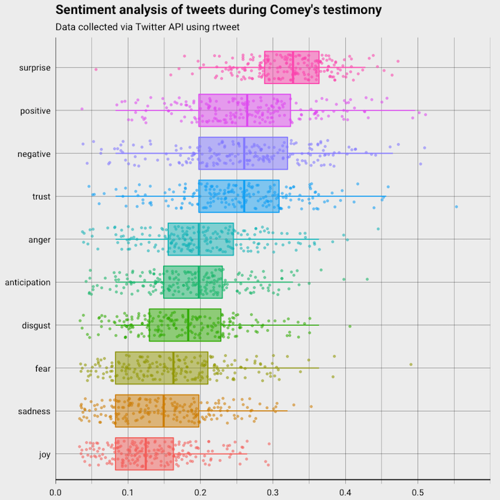
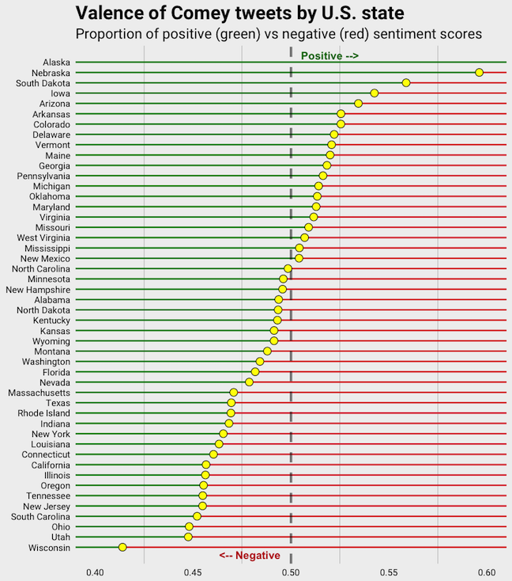
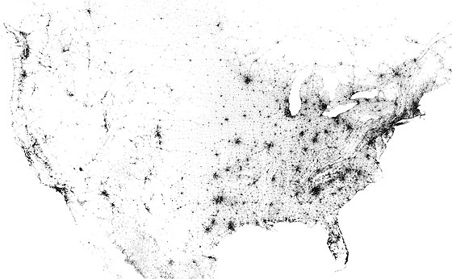
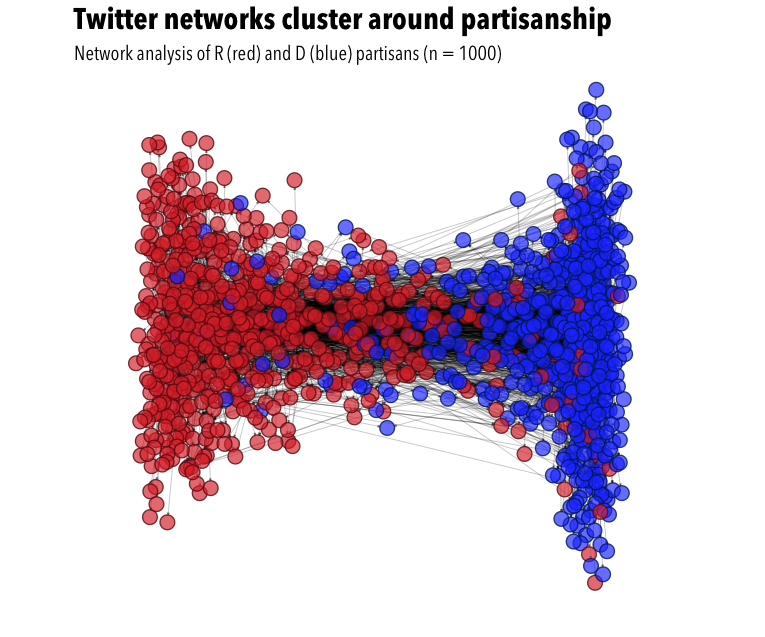

## My background
**Education**
- PhD in Communication Studies from KU
  - Grad minor in quantitative psychology
  - Center for Research Methods & Data Analysis

**Research**
- Interests are partisanship, selective exposure, new media
- Dissertation entitled...

---

## &nbsp;


---

## &nbsp;


---

## Agenda
- Twitter APIs
- Getting started with rtweet
  - Authorization token(s)
  - Package resources

- Quick tour of rtweet functions
  - Friends/followers
  - Users/tweets

--- .transition

## &nbsp;

<h1 class="mytransition">Twitter APIs</h1>

---

## Twitter data
- Twitter makes data available via Application Program Interfaces
  (API)
  - **API**: protocols for making and sending requests

- Twitter APIs of interest:
  - **REST**: Search, read profile info, post Tweets
  - **Streaming**: Monitor tweets in real-time

---

## Package resources
- Website: [mkearney.github.io/rtweet](https://mkearney.github.io/rtweet)
- Vignettes:

```{r, eval=FALSE}
## Authorizing API access
vignette(topic = "auth", package = "rtweet")

## Overview
vignette(topic = "intro", package = "rtweet")

## Streaming API
vignette(topic = "stream", package = "rtweet")
```

--- .transition

## &nbsp;

<h1 class="mytransition">Getting started with rtweet</h1>

---

## Installing and loading rtweet

```{r, eval=FALSE}
## download from CRAN
install.packages("rtweet")

## or download dev version from Github
if (!"devtools" %in% installed.packages()) {
    install.packages("devtools")
}
devtools::install_github("mkearney/rtweet")

## load rtweet
library(rtweet)
```

---

## Create Twitter App
- [https://apps.twitter.com](apps.twitter.com)
- For call back enter `http://127.0.0.1:1410`


---

## Keys and access tokens


---

## Copy keys


---

## Create token

```{r, eval=FALSE}
## whatever name you assigned to your created app
appname <- "rtweet_token"

## api key (example below is not a real key)
key <- "XYznzPFOFZR2a39FwWKN1Jp41"

## api secret (example below is not a real key)
secret <- "CtkGEWmSevZqJuKl6HHrBxbCybxI1xGLqrD5ynPd9jG0SoHZbD"

## create token named "twitter_token"
twitter_token <- create_token(
    app = appname,
    consumer_key = key,
    consumer_secret = secret)
```

---

## Save token

```{r, eval=FALSE}
## path of home directory
home_directory <- path.expand("~/")

## combine with name for token
file_name <- file.path(home_directory, "twitter_token.rds")

## save token to home directory
saveRDS(twitter_token, file = file_name)
```

## Set environment variable

```{r, eval=FALSE}
## On my mac, the .Renviron text looks like this:
##     TWITTER_PAT=/Users/mwk/twitter_token.rds

## assuming you followed the procodures to create "file_name"
##     from the previous code chunk, then the code below should
##     create and save your environment variable.
cat(paste0("TWITTER_PAT=", file_name),
    file = file.path(home_directory, ".Renviron"),
    append = TRUE)
```

--- .transition

## &nbsp;

<h1 class="mytransition">rtweet functions</h1>

---

## Streaming

```{r, eval=FALSE}
## comey stream
comes <- stream_tweets("comey,trump", timeout = 60 * 3)

## get plain text
twt <- plain_tweets(comes$text, include_hashtags = TRUE)

## sentiment analysis
sa <- syuzhet::get_nrc_sentiment(twt)
comes <- tibble::as_tibble(cbind(comes, sa))
```

--- .dark3

## Sentiment analysis
<br>
<div style="margin-left: auto; margin:right: auto;">

</div>

--- .dark3

## &nbsp;

<div style="margin-left: auto; margin:right: auto;">

</div>

--- .dark3

## &nbsp;




--- .sentanalysis

## &nbsp;


--- .sentanalysis

## User networks
- In my dissertation, I tracked user networks on Twitter during the
  2016 election
- Republican group: users who followed one or more of the following:
  - Sean Hannity, Sarah Palin, Fox News Politics, and Drudge Report
- Democrat group: users who followed one or more of the following:
  - Rachel Maddow, Paul Krugman, HuffPost Politics, and Salon

--- .sentanalysis

## &nbsp;


--- .netanalysis

## &nbsp;




--- .transition

## &nbsp;

<h1 class="mytransition">That's it \o/<br><br>Thanks!</h1>


---

## Packages
- httr
- jsonlite
- devtools
